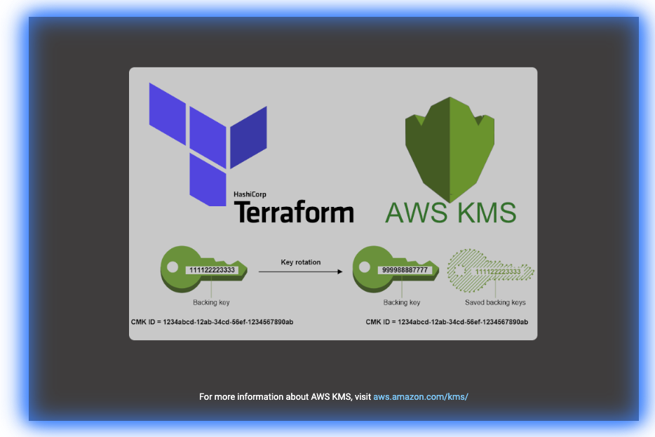

<!-- VSCode Markdown Exclusions-->
<!-- markdownlint-disable MD025 Single Title Headers-->
# CloudMage Terraform ActionsTest Module

<br>


<br>

# Getting Started

This Terraform module was created to quickly and easily provision a secure AWS Key Management Service (KMS) Customer Managed Key (CMK). CMK's are used for server-side encryption on AWS services such as S3 buckets, EBS volumes, Dynamo DB Tables, or any other service where data encryption is required. This module also includes optional variables that allow the consumer of the module to choose how KMS Key policies will be constructed and placed on be the CMK at the time of provisioning.

<br><br>

# Module Pre-Requisites and Dependencies

This module does not currently have any pre-requisites or dependency requirements.

<br><br>

# Module Directory Structure

```bash
    ├── outputs.tf
├── main.tf
├── requirements.txt
├── CHANGELOG.md
├── images
│   ├── tf_kms.png
│   ├── tf_kms_tags.png
│   ├── optional.png
│   ├── neon_optional.png
│   ├── required.png
│   └── neon_required.png
├── gendoc.py
├── example
│   ├── env.tfvars
│   ├── outputs.tf
│   ├── main.tf
│   ├── README.md
│   └── variables.tf
├── SampleGitHubCall.json
├── gendoc.log
├── README.md
├── README.yaml
├── variables.tf
├── templates
│   ├── CHANGELOG.j2
│   └── README.j2
└── ORIGIN_README.md

```
<br><br>

# Module Usage <<<<<<<<<<NOT COMPLETED>>>>>>>>>>>>>>>>

```terraform
module "kms" {
  source = "git@github.com:tapestryinc/TF-AWS-KMS-Module?ref=v1.0.3"

  // Required Variables
  kms_key_description       = "KMS key provisioned to encrypt prod s3 bucket"
  kms_key_alias_name        = "prod/s3"
  
  // Optional Variables with module defined default values assigned
  # kms_owner_principal_list    = []
  # kms_admin_principal_list    = []
  # kms_user_principal_list     = []
  # kms_resource_principal_list = []
  
  // Tags
  # kms_tags                    = {
  #   Provisioned_By    = "Terraform"
  #   Module_GitHub_URL = "https://github.com/CloudMage-TF/AWS-KMS-Module.git"
  # }
}
```

<br><br>

# Terraform Variables

Module variables that need to either be defined or re-defined with a non-default value can easily be hardcoded inline directly within the module call block or from within the root project that is consuming the module. If using the second approach then the root project must have it's own custom variables defined within the projects `variables.tf` file with set default values or with the values provided from a separate environmental `terraform.tfvar` file. Examples of both approaches can be found below. Note that for the standards used within this documentation, all variables will mostly use the first approach for ease of readability.

<br>

> __NOTE:__ There is also a third way to provide variable values using Terraform data sources. A data source is a unique type of code block used within a project that either instantiates or collects data that can be referenced throughout the project. A data source, for example,  can be declared to read the terraform state file and gather all of the available information from a previously deployed project stack. Any of the data contained within the data source can then be referenced to set the value of a project or module variable.

<br><br>

## Setting Variables Inline <<<<<<<<<<NOT COMPLETED>>>>>>>>>>>>>>>>

```terraform
module "kms" {
  source = "git@github.com:CloudMage-TF/AWS-KMS-Module?ref=v1.0.0"

  // Required Variables
  kms_key_alias_name = "prod/s3"
}
```

<br><br>

## Setting Variables in a Terraform Root Project <<<<<<<<<<NOT COMPLETED>>>>>>>>>>>>>>>>

<br>

### Terraform Root Project/variables.tf

```terraform
variable "cmk_alias" {
  type        = string
  description = "Meaningful Description"
}
```

<br>

### Terraform Root Project/terraform.tfvars <<<<<<<<<<NOT COMPLETED>>>>>>>>>>>>>>>>

```terraform
cmk_alias = "dev/ebs"
```

<br>

### Terraform Root Project/main.tf <<<<<<<<<<NOT COMPLETED>>>>>>>>>>>>>>>>

```terraform
module "kms" {
  source = "git@github.com:CloudMage-TF/AWS-KMS-Module?ref=v1.0.0"

  // Required Variables
  kms_key_alias_name = var.cmk_alias
}
```

<br><br>

# Required Variables

The following required module variables do not contain default values and must be set by the consumer of the module to use the module successfully.

<br><br>

## :red_circle: kms_key_alias_name

<br>


<br>

The alias that will be assigned to the provisioned KMS CMK. This value will be appended to alias/ within the module automatically.

<br><br>

### Declaration in module variables.tf

```terraform
variable "kms_key_alias_name" {
  type        = string
  description = The alias that will be assigned to the provisioned KMS CMK. This value will be appended to alias/ within the module automatically.
}
```

<br><br>

### Module usage in project root main.tf <<<<<<<<<<NOT COMPLETED>>>>>>>>>>>>>>>>

```terraform
module "kms" {
  source = "git@github.com:CloudMage-TF/AWS-KMS-Module?ref=v1.0.0"

  // Required Variables
  kms_key_alias_name        = "prod/s3"
}
```

<br><br><br>
## :red_circle: kms_key_description

<br>


<br>

The description that will be applied to the provisioned KMS Key.

<br><br>

### Declaration in module variables.tf

```terraform
variable "kms_key_description" {
  type        = string
  description = The description that will be applied to the provisioned KMS Key.
}
```

<br><br>

### Module usage in project root main.tf <<<<<<<<<<NOT COMPLETED>>>>>>>>>>>>>>>>

```terraform
module "kms" {
  source = "git@github.com:CloudMage-TF/AWS-KMS-Module?ref=v1.0.0"

  // Required Variables
  kms_key_alias_name        = "prod/s3"
}
```

<br><br><br>
<br><br>

# Optional Variables

The following optional module variables are not required because they already have default values assigned when the variables where defined within the modules `variables.tf` file. If the default values do not need to be changed by the root project consuming the module, then they do not even need to be included in the root project. If any of the variables do need to be changed, then they can be added to the root project in the same way that the required variables were defined and utilized. Optional variables also may alter how the module provisions resources in the cases of encryption or IAM policy generation. A variable could flag an encryption requirement when provisioning an S3 bucket or Dynamo table by providing a KMS CMK, for example. Another use case may be the passage of ARN values to allow users or roles access to services or resources, whereas by default permissions would be more restrictive or only assigned to the account root or a single IAM role. A detailed explanation of each of this modules optional variables can be found below:

<br><br>

## :large_blue_circle: kms_owner_principal_list

<br>


<br>

List of users/roles/accounts that will own and have kms:* on the provisioned CMK.

<br><br>

### Declaration in module variables.tf

```terraform
variable "kms_owner_principal_list" {
  type        = list
  description = List of users/roles/accounts that will own and have kms:* on the provisioned CMK.
  default     = []
}
```

<br><br>

### Module usage in project root main.tf <<<<<<<<<<NOT COMPLETED>>>>>>>>>>>>>>>>

```terraform
module "kms" {
  source = "git@github.com:CloudMage-TF/AWS-KMS-Module?ref=v1.0.0"

  // Required Variables
  kms_key_alias_name        = "prod/s3"
}
```

<br><br><br>
## :large_blue_circle: kms_admin_principal_list

<br>


<br>

List of users/roles that will be key administrators of the provisioned KMS CMK

<br><br>

### Declaration in module variables.tf

```terraform
variable "kms_admin_principal_list" {
  type        = list
  description = List of users/roles that will be key administrators of the provisioned KMS CMK
  default     = []
}
```

<br><br>

### Module usage in project root main.tf <<<<<<<<<<NOT COMPLETED>>>>>>>>>>>>>>>>

```terraform
module "kms" {
  source = "git@github.com:CloudMage-TF/AWS-KMS-Module?ref=v1.0.0"

  // Required Variables
  kms_key_alias_name        = "prod/s3"
}
```

<br><br><br>
## :large_blue_circle: kms_user_principal_list

<br>


<br>

List of users/roles that will be granted usage of the provisioned KMS CMK.

<br><br>

### Declaration in module variables.tf

```terraform
variable "kms_user_principal_list" {
  type        = list
  description = List of users/roles that will be granted usage of the provisioned KMS CMK.
  default     = []
}
```

<br><br>

### Module usage in project root main.tf <<<<<<<<<<NOT COMPLETED>>>>>>>>>>>>>>>>

```terraform
module "kms" {
  source = "git@github.com:CloudMage-TF/AWS-KMS-Module?ref=v1.0.0"

  // Required Variables
  kms_key_alias_name        = "prod/s3"
}
```

<br><br><br>
## :large_blue_circle: kms_resource_principal_list

<br>


<br>

List of users/roles that will be granted permissions to create/list/delete temporary grants to the provisioned KMS CMK.

<br><br>

### Declaration in module variables.tf

```terraform
variable "kms_resource_principal_list" {
  type        = list
  description = List of users/roles that will be granted permissions to create/list/delete temporary grants to the provisioned KMS CMK.
  default     = []
}
```

<br><br>

### Module usage in project root main.tf <<<<<<<<<<NOT COMPLETED>>>>>>>>>>>>>>>>

```terraform
module "kms" {
  source = "git@github.com:CloudMage-TF/AWS-KMS-Module?ref=v1.0.0"

  // Required Variables
  kms_key_alias_name        = "prod/s3"
}
```

<br><br><br>
## :large_blue_circle: kms_tags

<br>


<br>

Specify any tags that should be added to the KMS CMK being provisioned.

<br><br>

### Declaration in module variables.tf

```terraform
variable "kms_tags" {
  type        = map
  description = Specify any tags that should be added to the KMS CMK being provisioned.
  default     = {'Provisioned_By': 'Terraform', 'Module_GitHub_URL': 'https://github.com/CloudMage-TF/AWS-KMS-Module.git'}
}
```

<br><br>

### Module usage in project root main.tf <<<<<<<<<<NOT COMPLETED>>>>>>>>>>>>>>>>

```terraform
module "kms" {
  source = "git@github.com:CloudMage-TF/AWS-KMS-Module?ref=v1.0.0"

  // Required Variables
  kms_key_alias_name        = "prod/s3"
}
```

<br><br><br>
